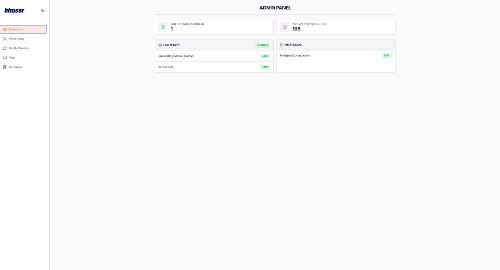
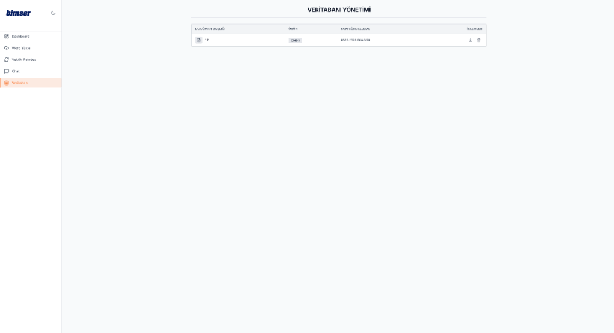
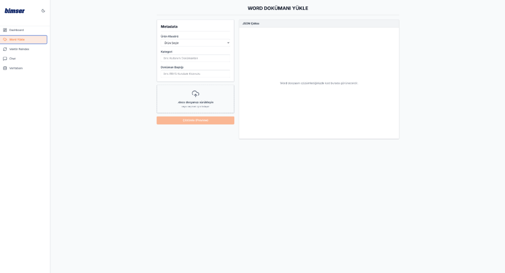

<div align="center">
  <h1>Bimser RAG Admin Paneli</h1>
  <p>Şirket İçi Doküman Yönetimi, Yapay Zeka ve Vektör Veritabanı Kontrol Merkezi</p>
</div>

---

## Proje Hakkında

Bu proje, Bimser RAG (Retrieval-Augmented Generation) sisteminin kalbini oluşturan **Yönetim Paneli (Frontend)** uygulamasıdır. 
Kullanıcılar bu panel üzerinden sisteme Word veya PDF belgeleri yükleyebilir, belgelerin vektörel parçalara (chunk) ayrılmasını takip edebilir ve PostgreSQL veritabanındaki indekslenmiş dokümanları yönetebilirler.

### Öne Çıkan Özellikler

*   **Canlı Durum Takibi (Dashboard):** Veritabanı, Ollama (Llama 3.1) ve indekslenmiş doküman sayısını anlık takip etme.
*   **Doküman Yükleme & Analiz:** Yüklenen belgeleri otomatik olarak `pgvector` uzayına dahil etme.
*   **Sistem Testi (Chat):** Yüklenen belgeler üzerinden RAG sisteminin nasıl cevap verdiğini direkt panel üzerinden test edebilme.
*   **Modern Arayüz:** Next.js 14, Tailwind CSS ve TypeScript ile geliştirilmiş hızlı ve responsive tasarım.

---

## Ekran Görüntüleri

### 1. Ana Kontrol Paneli (Dashboard)
Sistemdeki tüm servislerin anlık sağlık durumunu ve vektör istatistiklerini gösterir.


### 2. Doküman Yönetimi (Veritabanı)
PostgreSQL'e indekslenmiş tüm dokümanların listesi ve silme/indirme işlemleri.


### 3. Belge Yükleme ve Çözümleme (Parsing)
Sisteme Word (.docx) belgelerinin aktarılması ve yapay zeka tarafından parse edilmesi.


---

## Mimari ve Teknolojiler

*   **Framework:** Next.js 14 (App Router)
*   **Dil:** TypeScript
*   **Stil:** Tailwind CSS
*   **Bağlantı:** FastAPI Backend (`bimser-rag-api`) ile entegre.

---

## Kurulum (Local Development)

Paneli bilgisayarınızda çalıştırmak için aşağıdaki adımları izleyin:

### Gereksinimler
*   Node.js (v18 veya üzeri)
*   Arka planda `bimser-rag-api` projesinin (Backend) 8000 portunda çalışıyor olması gerekir.

### Adım Adım Kurulum

1.  **Projeyi Klonlayın:**
    ```bash
    git clone https://github.com/kadirerentugran/bimser-rag-admin.git
    cd bimser-rag-admin
    ```

2.  **Bağımlılıkları Kurun:**
    ```bash
    npm install --legacy-peer-deps
    ```

3.  **Çalıştırın:**
    ```bash
    npm run dev
    ```

4.  **Erişim:**
    Tarayıcınızdan şu adrese giderek paneli açabilirsiniz:
    **[http://localhost:3000](http://localhost:3000)**

*(Not: Login ekranı geliştirme ortamında bypass edilmiştir, herhangi bir değer girerek geçebilirsiniz.)*

---
